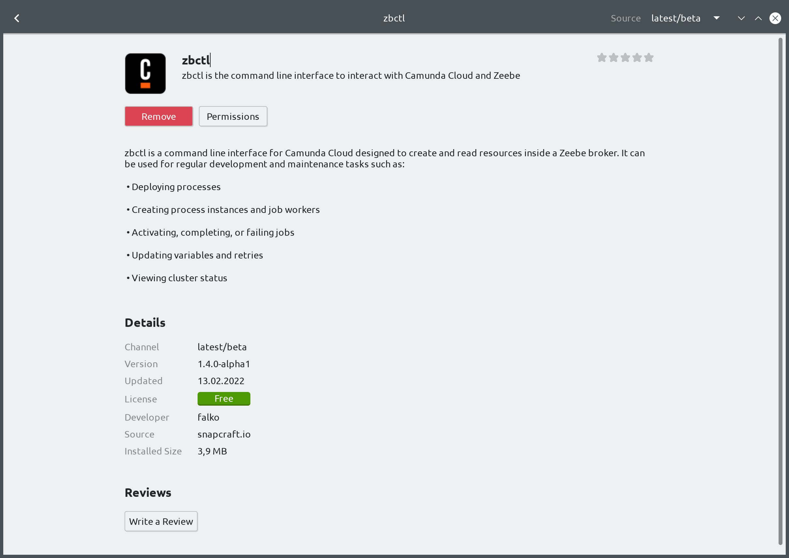

[](https://github.com/camunda-community-hub/community)

[](https://github.com/Camunda-Community-Hub/community/blob/main/extension-lifecycle.md#incubating-)

# zbctl via Snap

[](https://snapcraft.io/zbctl)
[](https://snapcraft.io/zbctl)

Zeebe CLI via [Snap](https://snapcraft.io/).

This is a [Snap](https://snapcraft.io/about) package of
[zbctl](https://github.com/camunda-community-hub/zeebe-client-go/edit/main/cmd/zbctl/zbctl.md) (the command-line client for [Camunda Platform 8](https://camunda.com)).

With this you can easily install zbctl on Linux and keep it up to date through the automatic updater of your distro. The package also shows up if you search for 'Camunda' or 'Zeebe' in your package manager, e.g. 'Ubuntu Software' desktop app.



The snap build is based the official zbctl binaries from the GitHub release page. However, the fully automated build infrastructure provided for free by Snapcraft would also allow cross compilation to currently unsupported CPU architectures. For such a multi-platform build one would have to build from the go sources. The next tools to package like this would be Camunda Modeler and zdb.

## Installation

[](https://snapcraft.io/zbctl)

```sh
snap install zbctl
```

## Updating

```sh
snap refresh zbctl
```

## Testing alpha releases

```sh
snap install zbctl --channel=beta
```

## Usage

* [zbctl Documentation](https://github.com/camunda-community-hub/zeebe-client-go/edit/main/cmd/zbctl/zbctl.md)
* [zbctl Getting Started Guide](https://github.com/camunda-community-hub/zeebe-client-go/edit/main/cmd/zbctl/cli-get-started.md)

```
zbctl [options] [command]
```

```
zbctl is a command line interface for Camunda Platform 8 designed to create and read resources inside a Zeebe broker.
It can be used for regular development and maintenance tasks such as:
        * Deploying processes
        * Creating process instances and job workers
        * Activating, completing, or failing jobs
        * Updating variables and retries
        * Viewing cluster status

Usage:
  zbctl [command]

Available Commands:
  activate    Activate a resource
  cancel      Cancel resource
  complete    Complete a resource
  create      Create resources
  deploy      Creates new workflow defined by provided BPMN or YAML file as workflowPath
  fail        Fail a resource
  generate    Generate documentation
  help        Help about any command
  publish     Publish a message
  resolve     Resolve a resource
  set         Set a resource
  status      Checks the current status of the cluster
  update      Update a resource
  version     Print the version of zbctl

Flags:
      --address string        Specify a contact point address. If omitted, will read from the environment variable 'ZEEBE_ADDRESS' (default '127.0.0.1:26500')
      --audience string       Specify the resource that the access token should be valid for. If omitted, will read from the environment variable 'ZEEBE_TOKEN_AUDIENCE'
      --authzUrl string       Specify an authorization server URL from which to request an access token. If omitted, will read from the environment variable 'ZEEBE_AUTHORIZATION_SERVER_URL' (default "https://login.cloud.camunda.io/oauth/token/")
      --certPath string       Specify a path to a certificate with which to validate gateway requests. If omitted, will read from the environment variable 'ZEEBE_CA_CERTIFICATE_PATH'
      --clientCache string    Specify the path to use for the OAuth credentials cache. If omitted, will read from the environment variable 'ZEEBE_CLIENT_CONFIG_PATH' (default "/Users/sitapati/.camunda/credentials")
      --clientId string       Specify a client identifier to request an access token. If omitted, will read from the environment variable 'ZEEBE_CLIENT_ID'
      --clientSecret string   Specify a client secret to request an access token. If omitted, will read from the environment variable 'ZEEBE_CLIENT_SECRET'
  -h, --help                  help for zbctl
      --insecure              Specify if zbctl should use an unsecured connection. If omitted, will read from the environment variable 'ZEEBE_INSECURE_CONNECTION'

Use "zbctl [command] --help" for more information about a command.
```

## Updating the Snap package

If you want to submit a PR to update the package with a newer version of `zbctl`, you need to:

1. Run `./update.sh` which will:
    1. Fetch that latest zbctl version number from the [zbctl release page](https://github.com/camunda-community-hub/zeebe-client-go/releases) using `gh`.
    1. Update the package version in `snap/snapcraft.yaml` to match the zbctl release version.
    1. Update the `source-checksum` with the SHA1 checksum of the `zbctl` binary from the [zbctl release page](https://github.com/camunda-community-hub/zeebe-client-go/releases).
1. Test locally
    1. Build the package locally by running `snapcraft`.
    1. Test the installation using `snap install zbctl_*_amd64.snap --dangerous`
1. Push to GitHub.
1. Once a pull request is merged to the main branch, Snapcraft will automatically build the package and publish it to the `edge` channel.
1. From there it can be installed and tested using:
    ```sh
    snap refresh zbctl --channel=edge
    zbctl version
    zbctl status
    ```
1. @falko promotes the package to the `stable` channel on the [Snap Store](https://snapcraft.io/zbctl/releases) after the [build](https://snapcraft.io/zbctl/builds) has finished.
